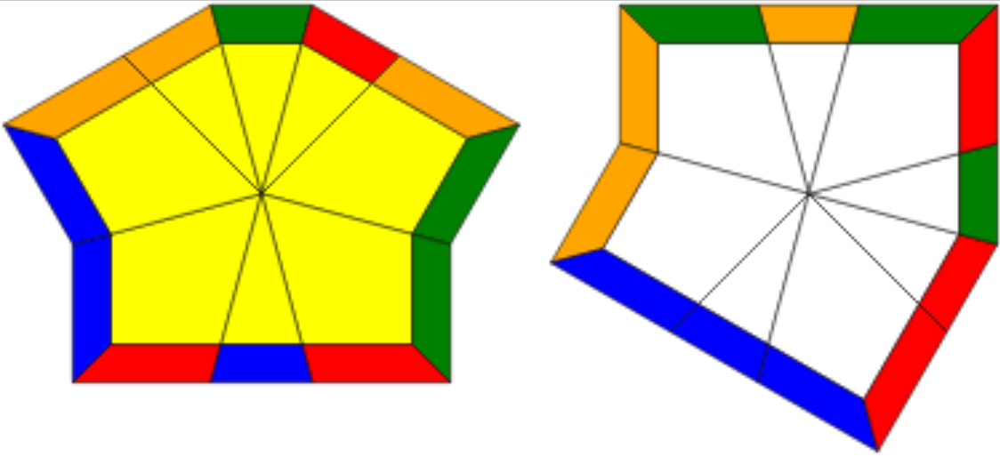

# cubeshaper

`cubeshaper` is a program that solves the **cubeshape** step of the [Square-1 puzzle](https://en.wikipedia.org/wiki/Square-1_(puzzle)). The program takes in an initial state of the puzzle and outputs a sequence of moves to restore it to cubeshape.

## Compilation

Use `g++` to compile. The `O3` flag helps with speed.

```sh
g++ -O3 -o cubeshaper cubeshaper.cpp
```

## Usage

```sh
./cubeshaper <topstate> <bottomstate>
```

`cubeshaper` takes in two command line arguments, representing the top and bottom layers.
Each argument is a string of 12 characters, out of the following:
- Corner piece: `CD`
- Edge piece: `E`

This means every `C` in the input must be followed by a `D`.
States are encoded starting at the slice and going clockwise.

### Example

To solve the following cubeshape case (muffin-kite):



Input:
```sh
./cubeshaper CDCDEEECDCDE CDEECDECDCDE
```

Output:
```sh
Solving the following state:
SquareOne
  U:CDCDEEECDCDE
  D:CDEECDECDCDE
Beginning cubeshape search...
Found solution: 0,0/2,0/6,1/5,2/4,0/1,0/3,3/
Found solution: 0,0/2,1/2,0/-4,0/0,-1/3,3/
```

The solutions are shown in a format similar to the WCA Square-1 scrambling notation.

## How It Works
The solver uses depth-first search to brute-force through all possible move sequences,
until it finds a solution that works. Then, it continues searching for shorter solutions,
displaying each better one found. This can take a long time for longer cubeshape cases.
A breadth-first search would be better, if I could figure out how to implement it...

## Library
The `SquareOne` class can be used for other Square-1 programming.
Just comment out the call to `runSolverCLI()` in `main()` of `cubeshaper.cpp`
and write your own code. Read over the public methods to see the
current functionality.
